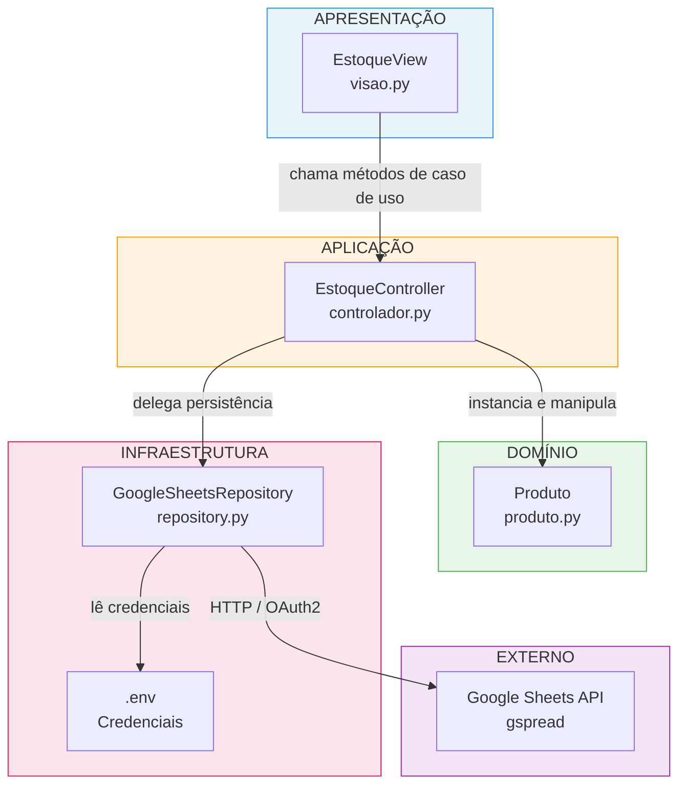
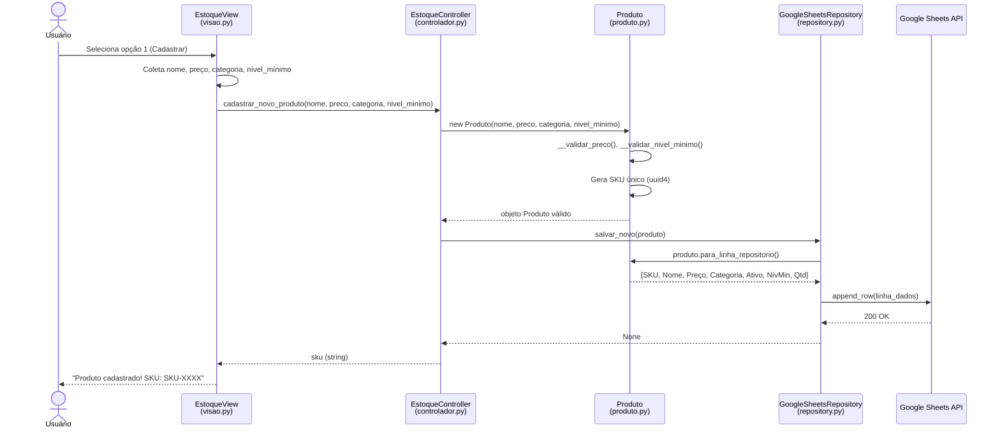
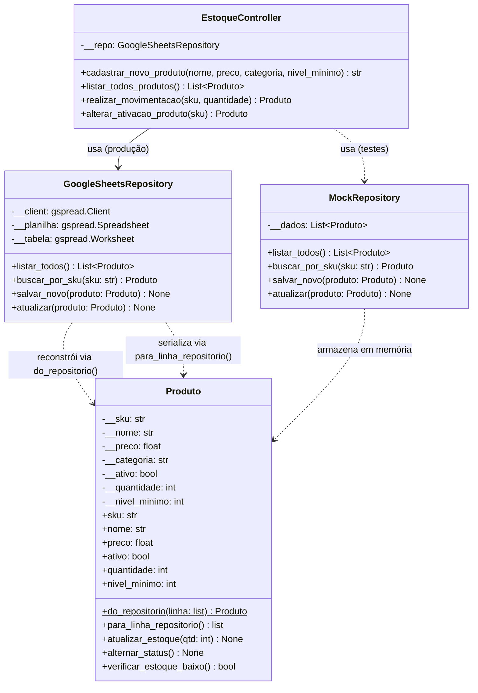
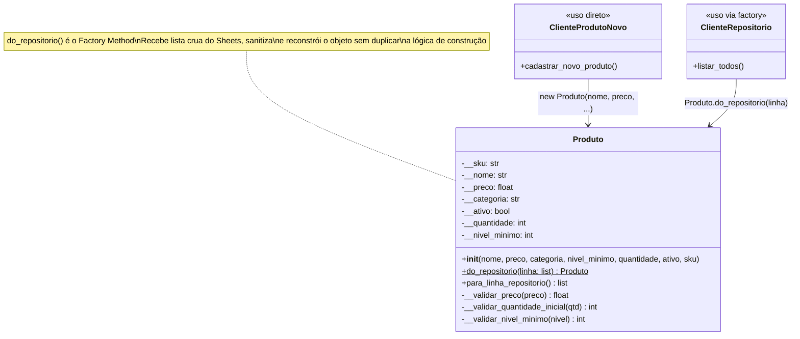
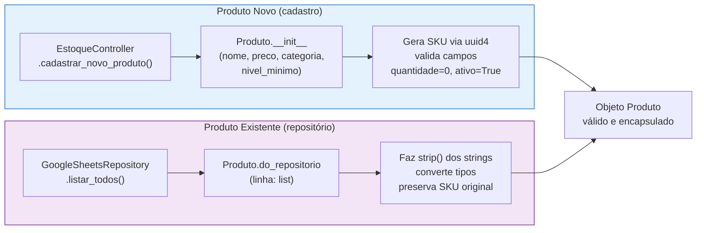
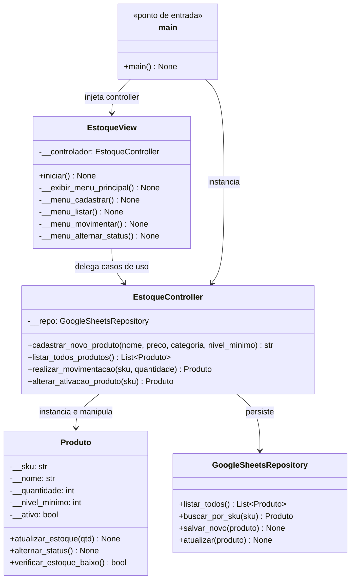

# StockFlow — Documentação de Arquitetura

> **Responsável:** Michel Rochytor Lima Barbosa  
> **Projeto:** StockFlow — Sistema de Gerenciamento de Estoque  
> **Stack:** Python 3.10+, Google Sheets API (gspread), python-dotenv

---

## 1. Padrões de Codificação e Gestão de Qualidade

### 1.1 Convenções de Estilo

| Elemento | Convenção adotada | Exemplo no código |
|---|---|---|
| Classes | `PascalCase` | `Produto`, `EstoqueController`, `GoogleSheetsRepository` |
| Métodos públicos | `snake_case` | `cadastrar_novo_produto()`, `listar_todos()` |
| Métodos privados | `__snake_case` (name mangling) | `__validar_preco()`, `__validar_nivel_minimo()` |
| Atributos privados | `__snake_case` | `self.__sku`, `self.__repo`, `self.__tabela` |
| Constantes de ambiente | `UPPER_SNAKE_CASE` | `GOOGLE_CREDENTIALS_PATH`, `SPREADSHEET_ID` |
| Type hints | PEP 484 em todas as assinaturas | `def listar_todos(self) -> List[Produto]` |

### 1.2 Princípios de Encapsulamento

O módulo `produto.py` aplica **encapsulamento rigoroso**: todos os atributos são privados (`__sku`, `__nome`, `__preco`, etc.) e expostos exclusivamente via `@property` somente-leitura. Mutações de estado são possíveis apenas através de métodos semânticos que incorporam validação:

```python
# Acesso controlado — sem setters expostos
@property
def sku(self) -> str:
    return self.__sku

# Mutação com regra de negócio embutida
def atualizar_estoque(self, qtd: int) -> None:
    if self.__quantidade + qtd < 0:
        raise ValueError("Ruptura de Estoque.")
    self.__quantidade += qtd
```

Isso garante que nenhum código externo coloque a entidade em estado inválido.

### 1.3 Tratamento de Erros

Adota-se a estratégia de **exceções tipadas com mensagens legíveis** (RNF-05), sem expor stack traces ao usuário final. A cadeia de captura é:

| Camada | Lança | Captura |
|---|---|---|
| `Produto` | `ValueError` (regra de negócio violada) | `EstoqueController` / `EstoqueView` |
| `GoogleSheetsRepository` | `RuntimeError` (falha de IO/API) | `EstoqueView` |
| `EstoqueView` | — | Captura `ValueError` e `Exception` separadamente, exibindo mensagem formatada |

### 1.4 Separação de Responsabilidades (SRP)

Cada módulo tem **uma única razão para mudar**:

| Módulo | Responsabilidade única |
|---|---|
| `produto.py` | Modelo de domínio, validações e regras de negócio |
| `repository.py` | Comunicação com a Google Sheets API |
| `controlador.py` | Orquestração dos casos de uso |
| `visao.py` | Interface CLI e formatação de saída |
| `main.py` | Ponto de entrada e composição do sistema |

### 1.5 Gestão de Qualidade

**Testabilidade:** A arquitetura em camadas (RNF-01, RNF-02) permite que `Produto` e `EstoqueController` sejam testados com um mock de `GoogleSheetsRepository`, sem dependência de rede. O repositório real implementa uma interface implícita com os métodos `salvar_novo`, `listar_todos`, `buscar_por_sku` e `atualizar`, que podem ser substituídos por doubles de teste.

**Cobertura:** Meta de ≥ 80% nas classes de domínio e serviço, medida via `coverage.py` (RNF-08).

**Rastreabilidade:** Todo requisito funcional possui caso de teste correspondente mapeado na tabela RF → Teste do documento de requisitos.

---

## 2. Diagrama de Arquitetura

### 2.1 Visão em Camadas

O sistema segue uma **arquitetura em três camadas** com dependências estritamente unidirecionais (RNF-01), complementada pelo padrão Repository para abstração da persistência.

```
┌──────────────────────────────────────────────────────────┐
│                    CAMADA DE APRESENTAÇÃO                │
│                       visao.py                           │
│              EstoqueView  ·  CLI / stdin-stdout          │
└──────────────────┬───────────────────────────────────────┘
                   │ depende de (injeção via __init__)
                   ▼
┌──────────────────────────────────────────────────────────┐
│                   CAMADA DE APLICAÇÃO                    │
│                    controlador.py                        │
│            EstoqueController  ·  Casos de Uso            │
└──────────────────┬───────────────────────────────────────┘
                   │ depende de
         ┌─────────┴──────────┐
         ▼                    ▼
┌────────────────┐  ┌─────────────────────────────────────┐
│   DOMÍNIO      │  │        CAMADA DE INFRAESTRUTURA      │
│  produto.py    │  │           repository.py              │
│   Produto      │  │     GoogleSheetsRepository           │
│  (Entidade)    │  │     ·  gspread  ·  google-auth       │
└────────────────┘  └──────────────────┬──────────────────┘
                                       │ I/O
                                       ▼
                           ┌───────────────────────┐
                           │   Google Sheets API    │
                           │  (Persistência remota) │
                           └───────────────────────┘
```



### 2.2 Fluxo de uma Operação — Cadastrar Produto



### 2.3 Responsabilidades e Trade-offs Justificados

| Decisão de Design | Justificativa | Trade-off |
|---|---|---|
| **Google Sheets como único armazenamento** | Alinhamento com o hábito do stakeholder (planilha já é a "verdade oficial"); zero setup de banco de dados; acesso multi-dispositivo gratuito | Latência de rede em cada operação; sujeito à quota da API; sem transações ACID |
| **CLI em vez de GUI/Web** | Simplicidade de deploy (apenas `python main.py`); sem dependência de servidor web; foco nas regras de negócio para fins acadêmicos | Menor usabilidade para usuários não técnicos; dificulta futuras integrações |
| **Repository acoplado ao Google Sheets (sem interface abstrata explícita)** | Reduz complexidade inicial; o projeto é pequeno e o repositório é o único backend previsto | Para trocar de backend, é necessário reescrever `repository.py`; testes de integração exigem mock manual |
| **SKU gerado por UUID (parcial)** | Garante unicidade sem consultar a API (evita round-trip); sem colisão em ambientes distribuídos | SKU não é legível por humanos; não segue padrão de negócio customizável |
| **Entidade Produto sem herança** | Domain model plano é suficiente para o escopo; evita complexidade de hierarquia | Se categorias exigirem comportamentos distintos no futuro, refatoração será necessária |
| **python-dotenv para credenciais** | Separa segredos do código-fonte; padrão de facto para projetos Python | Requer que o arquivo `.env` não seja versionado (necessita `.gitignore` correto) |

---

## 3. Padrões de Projeto

### 3.1 Padrão 1 — Repository (Acesso a Dados)

#### Intenção

Abstrair o mecanismo de persistência, isolando o domínio dos detalhes de acesso a dados. O controlador interage com uma interface de repositório, não com a API concreta.

#### Estrutura no StockFlow



#### Como funciona no código

`EstoqueController` nunca referencia `gspread` diretamente. Ele chama métodos semânticos do repositório (`buscar_por_sku`, `atualizar`, `salvar_novo`), desconhecendo completamente se os dados estão numa planilha, num banco SQL ou em memória. Para testes, basta construir um `MockRepository` com a mesma interface e injetá-lo.

```python
# controlador.py — o Controller não sabe NADA sobre gspread
class EstoqueController:
    def __init__(self):
        self.__repo = GoogleSheetsRepository()  # ← ponto de acoplamento isolado

    def realizar_movimentacao(self, sku: str, quantidade: int) -> Produto:
        produto = self.__repo.buscar_por_sku(sku)   # interface do repositório
        produto.atualizar_estoque(quantidade)        # regra de negócio no domínio
        self.__repo.atualizar(produto)               # interface do repositório
        return produto
```

---

### 3.2 Padrão 2 — Factory Method (Construção de Entidades)

#### Intenção

Definir uma interface para criar objetos, mas deixar subclasses (ou métodos de classe) decidirem como instanciar. No StockFlow, o Factory Method separa a **construção a partir de dados externos** (repositório) da **construção de um produto novo**.

#### Estrutura no StockFlow



#### Dois caminhos de criação



#### Por que é um Factory Method

O método de classe `do_repositorio` é um **constructor alternativo** que encapsula a lógica de conversão de dados brutos do Google Sheets em um objeto `Produto` válido. Sem ele, essa lógica de conversão estaria espalhada no repositório, violando SRP:

```python
# produto.py — Factory Method como @classmethod
@classmethod
def do_repositorio(cls, linha: list) -> 'Produto':
    """Reconstrói um objeto Produto removendo espaços em branco das strings."""
    sku_limpo    = linha[0].strip()
    nome_limpo   = linha[1].strip()
    preco_limpo  = float(linha[2].strip())
    ativo_limpo  = linha[4].strip().lower() == 'true'
    # ...
    return cls(sku=sku_limpo, nome=nome_limpo, preco=preco_limpo, ...)

# repository.py — usa o factory, sem conhecer os detalhes de conversão
prod = Produto.do_repositorio(linha)   # ← limpeza e conversão na entidade, não aqui
```

---

### 3.3 Padrão 3 — MVC adaptado para CLI

#### Intenção

Separar a interface do usuário (View), a lógica de casos de uso (Controller) e o modelo de domínio (Model), permitindo que cada camada evolua independentemente.

#### Mapeamento no StockFlow



#### Injeção de Dependência no ponto de entrada

`main.py` atua como **composição raiz**: instancia o `EstoqueController` e o injeta na `EstoqueView`. A View nunca cria o Controller internamente, o que permite substituir a implementação sem modificar a View:

```python
# main.py — composição raiz (Dependency Injection manual)
controlador = EstoqueController()       # instância real com Google Sheets
interface   = EstoqueView(controlador)  # View recebe o controlador pronto
interface.iniciar()
```

---

## 4. Sumário dos Padrões Aplicados

| Padrão | Categoria (GoF) | Módulos envolvidos | Benefício principal |
|---|---|---|---|
| **Repository** | Arquitetural | `repository.py` ↔ `controlador.py` | Isola persistência; viabiliza testes sem API real |
| **Factory Method** | Criacional | `produto.py` (`do_repositorio`) | Encapsula conversão de dados externos; evita código de parsing espalhado |
| **MVC (CLI)** | Arquitetural | `visao.py`, `controlador.py`, `produto.py` | Separação de responsabilidades; View e Model evoluem independentemente |
| **Dependency Injection** | Comportamental | `main.py` → `visao.py` | Facilita substituição do Controller; reduz acoplamento |

---

*Documento elaborado pela equipe StockFlow — Daniel Elder Kroda (especificação), Michel Rochytor Lima Barbosa (arquitetura), João Pedro Gonçalves de Oliveira (testes).*